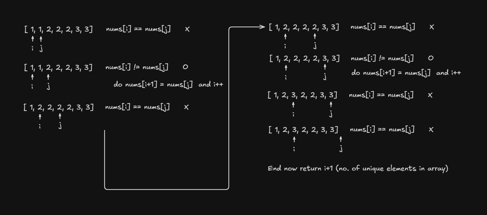

### Q. Remove Duplicates from Sorted Array

Given an integer array `nums` sorted in non-decreasing order, remove the duplicates in-place such that each unique element appears only once. The relative order of the elements should be kept the same.

Consider the number of unique elements in `nums` to be `k​​​​​​​​​​​​​​`. After removing duplicates, return the number of unique elements `k`.

The first `k` elements of nums should contain the unique numbers in sorted order. The remaining elements beyond index `k - 1` can be ignored.

Ex:
```
Input:  nums = [1,1,2,2,3]

Output: 3

Array after modification: [1,2,3,_,_]
```

### Ans:

Using two pointers

Because the array is sorted, duplicates are always next to each other


We use two pointers:

- j → checks every element
- i → keeps track of where the next unique element should go

1. Start  j = 1 because the first element is already unique.
2. For each j, compare nums[j] with nums[i].
3. If they are different, copy nums[j] to nums[i+1] and increment 1
4. At the end, i+1 is the number of unique elements.



### Complexity

```
Time: O(n)
Space: O(1)
```